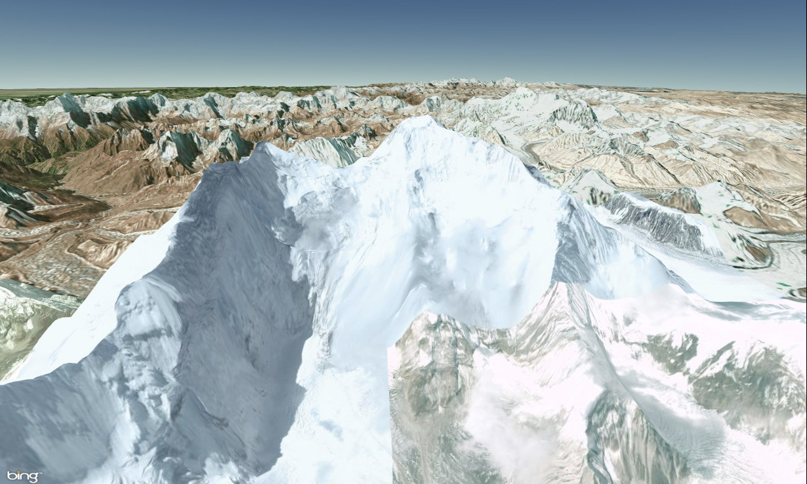
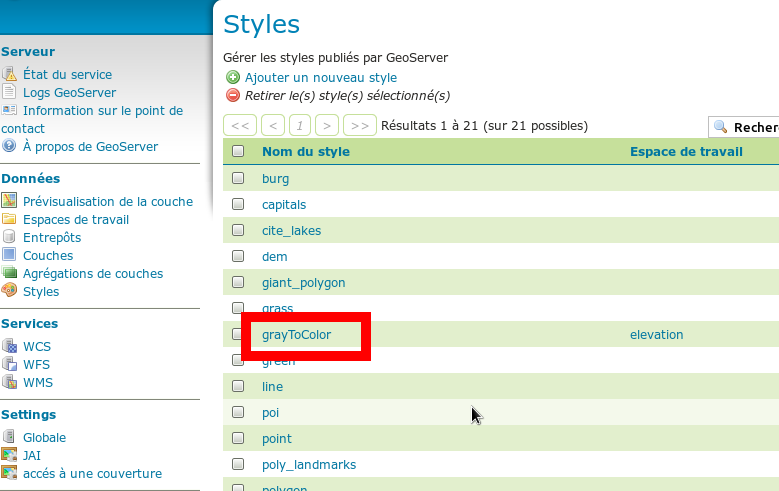
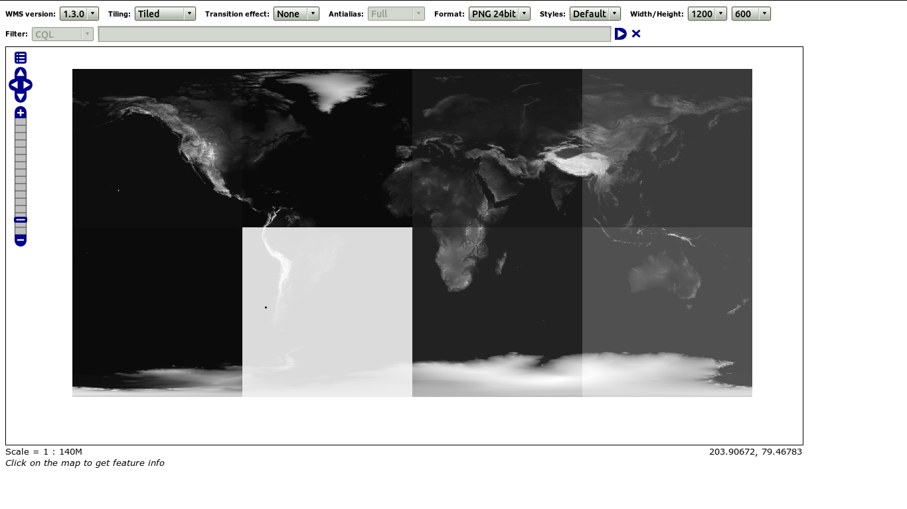
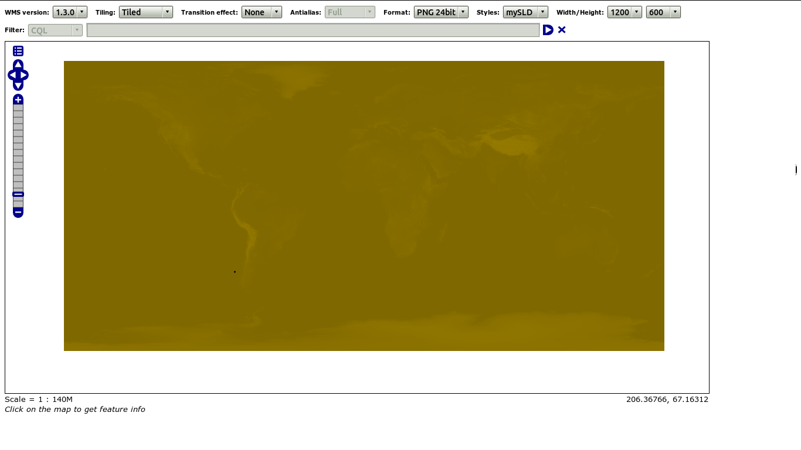
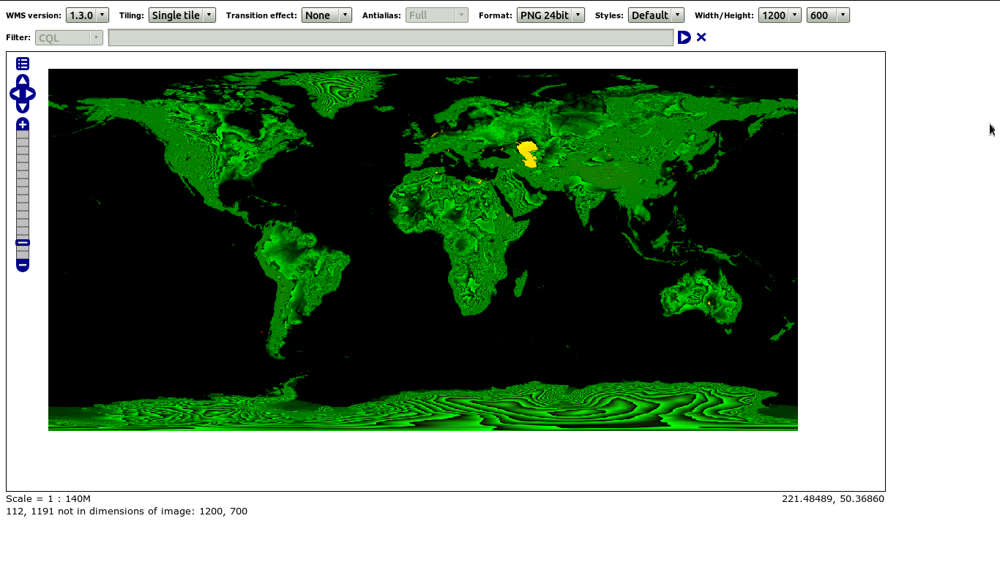

cesium-GeoserverTerrainProvider
================

GeoserverTerrainProvider: A terrain provider which works with geoserver providing elevation datas in bil, png, gif and jpeg formats. The png format should be prefered. 

# Cesium version 
Tested with Cesium 1.6 and geoserver 2.6.2.

License: Apache 2.0. Free for commercial and non-commercial use. See LICENSE.md.

# Usage

- Optional: import mySLD.xml as a new style in geoserver to render your layer (16 bits grayscale) in other color range.
- Import the GeoserverTerrainProvider.js file into your html codes after importing Cesium.js.
- Create a new instance of GeoserverTerrainProvider with url of your geoserver and name of elevation layer.

After that, the GeoserverTerrainProvider will determine the capabilities of geoserver (request getCapabilities) and will be ready to provide terrain data.

# Example

    
    
    <body>
	<canvas id="cesiumContainer"></canvas>
	
    </body>
    
Where
<ul>
	<li>"http://localhost:8080/geoserver/elevation/wms" is the url to the "elevation" workspace stored in geoserver (mandatory)	</li>
	<li>"SRTM90" is the name of the layer in "elevation" workspace (mandatory)	</li>
	<li>"waterMask" indicates that a water mask will be displayed (optional and experimental)	</li>
	<li>"styleName" is the name of mySLD.xml imported style in geoserver (optional see chapter below)	</li>
</ul>

Display created with bing map imagery provider and geoserverTerrainProvider. This last was configured with SRTM map of 90 meters resolution.

# More precisions on styleName parameter
- You'll find "styleName" parameter after inserting mySLD.xml as a new style usable for the elevation layer (here it's grayToColor)

 
The "styleName" parameter is useful when bil plugin can't provide good data. Nevertheless it takes lots of time to geoserver to generate a new image with style. Beforehand, thank to GeoWebCache you can generate the styled images (very long process). 
 
# Which format? 
GeoserverTerrainProvider can work with BIL/DDS (use of BIL/DDS plugin in geoserver), styled Images (use of mySLD.xml) and converted Images (see [here](GeotiffTranslate.md)). The images have to be process by internet navigator also the image formats are gif, jpeg and png.

## Original geotiff
It's a 16 bit grayscale geotiff used by BIL/DDS plugin to generate an arrayData.

## Styled geotiff
It's a 8 bits red green blue geotiff format that geoserver serves as an image where most significant byte from 16 bit grayscale is stored in color red and least significant byte from 16 bit grayscale is stored in color green. Moreover there is an offset of 32768 meters in order to have only positive numbers.

## Converted geotiff BREAKING CHANGE
It's a 8 bits red green blue geotiff format that geoserver serves as an image where most significant byte from 16 bit grayscale is stored in color red and least significant byte from 16 bit grayscale is stored in color green. Moreover there is an offset of 32768 meters in order to have only positive numbers. The third color (blue) indicates if the pixel has a no data value.

## In nutshell

<table style="align:left;" border="1">
<tr style="center;">
  <th>  </th>
  <th>BIL/DDS</th>
  <th>styled images</th>
  <th>converted images</th>
</tr>
<tr>
  <td>HOW TO</td>
  <td>insert BIL/DDS plugin into geoserver library</td>
  <td>insert mySLD.xml into the list of styles in geoserver</td>
  <td>use GeotiffTranslate in order to convert your 16 bit grayscale geotiffs into 8 bits RGB color geotiff. The converted geotiffs must be inserted in a workspace of geoserver</td>
</tr>
<tr>
  <td>PROS</td>
  <td><ul><li>quick to process for geoserver and GeoserverTerrainProvider</li></ul></td>
  <td><ul><li>quick to process for GeoserverTerrainProvider</li></ul></td>
  <td><ul><li>quick to process for geoserver and GeoserverTerrainProvider</li><li>classical use case of geoserver (without SLD!!)</li></ul></td>
</tr>
<tr>
  <td>CONS</td>
  <td><ul><li>need to insert BILL/DDS plug in in geoserver library</li><li>BILL/DDS seems to be buggy for certain coordinates also in this case and to compensate, GeoserverTerrainProvider request, in image format, the same data (which could be long to process for styled images)</li></ul></td>
  <td><ul><li>can be slow to process for geoserver if not precached with GeoWebCache</li><li>precaching styled images can take a very long time</li></ul></td>
  <td><ul><li>need to convert original geotiff with GeotiffTranslate (see <a href="GeotiffTranslate.md">here</a>)</li><li>loss of precision, some terrains have breaches...</li></ul></td>
</tr>
</table> 

# Which service ?
GeoserverTerrainProvider can use:

 - Web Map Service provided by geoserver or geoWebCache (version 1.1.1 and version 1.3.0) more details [here](WMSParameters.md)
 - Tile Map Service provided by geoWebCache (version 1.0) [here](TMSParameters.md)
 - Web Map Tile Service provided by geoWebCache (version 1.0) [here](WMTSParameters.md)

# Little helps to use SRTM (elevation maps) in geoserver
- you can download SRTM data at http://srtm.csi.cgiar.org/  or http://www.viewfinderpanoramas.org/ (90 meters or 3 seconds arc resolution of map is better)
- install GDAL tools and python to work with SRTM http://trac.osgeo.org/gdal/wiki/DownloadingGdalBinaries 
- install geoserver image pyramid plugin 
- generate a pyramid from SRTM data with gdal_retile command from GDAL tools
- create a layer from generated pyramid ( a guide is available [here](http://docs.geoserver.org/latest/en/user/tutorials/imagepyramid/imagepyramid.html))

