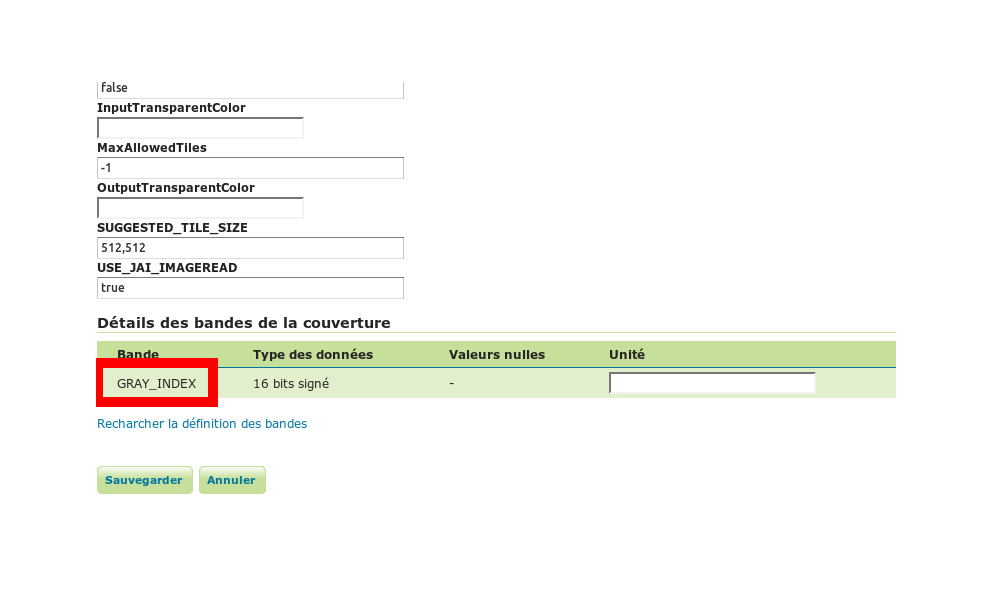

cesium-GeoserverTerrainProvider
================

GeoserverTerrainProvider: A terrain provider which works with geoserver providing elevation datas in bil, png, gif and jpeg formats. The bil format sholud be favour. 

#Cesium version 
Tested against b26 and geoserver 2.4.4.

License: Apache 2.0. Free for commercial and non-commercial use. See LICENSE.md.

#Usage

- Optional: import mySLD.xml as a new style in geoserver to render your layer (16 bit grayscale) in other color range.
- Import the GeoserverTerrainProvider.js file into your html codes after importing Cesium.js.
- Create a new instance of GeoserverTerrainProvider with url of your geoserver and name of elevation layer.
- It's possible to get altitude of a cartographic point with getHeight method.

After that, the GeoserverTerrainProvider will determine the capabilities of geoserver (WMS request getCapabilities) and will be ready to provide terrain data.

#Example

    
    
    <body>
	<canvas id="cesiumContainer"></canvas>
	
    </body>
Where
- "http://localhost:8080/geoserver/elevation/wms" is the url to the "elevation" workspace stored in geoserver (mandatory)
- "SRTM90" is the name of the layer in "elevation" workspace (mandatory)
- "64" is size of terrain cells request by GeoserverTerrainProvider (optional)
- "waterMask" indicates that a water mask will be displayed (optional and experimental)
- "styleName" is the name of mySLD.xml imported style in geoserver (optional see chapter below)
- "tagAltitudeProperty" is the name of coverage band in geoserver. (optional see chapter below)
- terrainProvider.getHeight(cartographic, callBack) provides a height promise of a cartographic point. callBack is a function who consumes the promise. 

Display created with bing map imagery provider and geoserverTerrainProvider. This last was configured with SRTM map of 90 meters resolution.

#More precisions on styleName and tagAltitudeProperty parameters
- You'll find "tagAltitudeProperty" parameter at the end of layer edit > data

- You'll find "styleName" parameter after inserting mySLD.xml as a new style usable for the elevation layer (here it's grayToColor)

 
The "styleName" parameter is useful when bil plugin can't provide good data...
 
#Little helps to use SRTM (elevation maps) in geoserver
- you can download SRTM data at http://srtm.csi.cgiar.org/  or http://www.viewfinderpanoramas.org/ (90 meters or 3 seconds arc resolution of map is better)
- install GDAL tools and python to work with SRTM http://trac.osgeo.org/gdal/wiki/DownloadingGdalBinaries 
- install geoserver image pyramid plugin 
- generate a pyramid from SRTM data with gdal_retile command from GDAL tools
- create a layer from generated pyramid

a guide is available at http://docs.geoserver.org/latest/en/user/tutorials/imagepyramid/imagepyramid.html 

